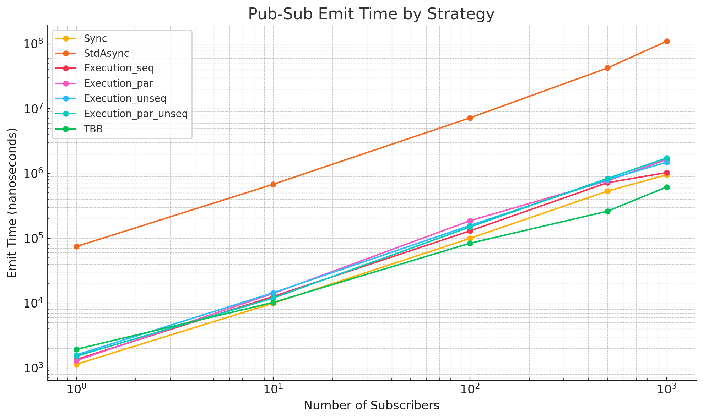

# 🏦 pubsub-lib

> A lightweight, header-only C++20 Publish-Subscribe library with type-safe events, RAII-based unsubscription, and async support.

---

[](https://github.com/cpp-for-everything/pubsub-lib/actions/workflows/ci.yaml)


---

## ✨ Features

- ✅ Type-safe event publishing
- ✅ Support for multiple publishers and event types
- ✅ RAII-based unsubscription via `SubscriptionToken`
- ✅ Subscriber lifetime management
- ✅ Async dispatching via `std::async`, `std::execution`, or oneTBB (if found)
- ✅ Header-only, C++20

---

## ✅ Compatibility

| OS       | Compiler     | Generator         | Status |
|----------|--------------|-------------------|--------|
| Ubuntu   | g++, clang++ | Makefiles, Ninja  | [](https://github.com/cpp-for-everything/pubsub-lib/actions/workflows/ci.yaml) |
| Windows  | MSVC         | Visual Studio 17  | [](https://github.com/cpp-for-everything/pubsub-lib/actions/workflows/ci.yaml) |
| macOS    | clang++, g++ | Makefiles, Ninja  | [](https://github.com/cpp-for-everything/pubsub-lib/actions/workflows/ci.yaml) |

> 🧪 All environments verified via GitHub Actions.

---

## 🚀 Getting Started

### CMake Project Integration

```bash
git clone https://github.com/cpp-for-everything/pubsub-lib.git
```

In your `CMakeLists.txt`:

```cmake
add_subdirectory(pubsub-lib)

target_link_libraries(my_app PRIVATE pubsub::pubsub)
```

### Or Install System-Wide

```bash
cmake -B build -S pubsub-lib -DCMAKE_INSTALL_PREFIX=/usr/local
cmake --build build --target install
```

Then:

```cmake
find_package(pubsub REQUIRED)
target_link_libraries(my_app PRIVATE pubsub::pubsub)
```

---

## 📃 Usage

### 1. Define Events

```cpp
constexpr auto MyEvent = pubsub::Event<void(int)>();
```

Or organize events:

```cpp
struct MyEvents {
    static constexpr auto Ping = pubsub::Event<void()>();
    static constexpr auto Data = pubsub::Event<void(int)>();
};
```

### 2. Create a Publisher

```cpp
pubsub::Publisher pub;
```

### 3. Subscribe

#### a) Lambda or free function

```cpp
pub.subscribe<MyEvents::Ping>([] { std::cout << "Ping!\n"; });
```

#### b) Member function

```cpp
struct Listener {
    void on_data(int x) { std::cout << "Got " << x << "\n"; }
} obj;

pub.subscribe<MyEvents::Data>(&obj, &Listener::on_data);
```

#### c) Lifetime-aware Subscriber class

```cpp
class MySubscriber : public pubsub::Subscriber {
    int total = 0;
public:
    void on_data(int x) { total += x; }

    void subscribe_to(pubsub::Publisher& pub) override {
        store_token(pub.subscribe<MyEvents::Data>(this, &MySubscriber::on_data));
        Subscriber::subscribe_to(pub);
    }

    void unsubscribe_from(pubsub::Publisher& pub) override {
        pub.unsubscribe<MyEvents::Data>(this);
    }
};
```

### 4. Emit Events

#### a) Synchronously

```cpp
pub.emit<MyEvents::Data>(123);
```

#### b) Using `std::async`

```cpp
pub.emit_thread_async<MyEvents::Data>(42);
```

#### c) oneTBB (if the TBB package is found by CMake)

```cpp
pub.emit_tbb_async<MyEvents::Data>(42);
```

> ⚠️ Make sure [oneTBB](https://github.com/oneapi-src/oneTBB) is installed and discoverable by CMake.

#### d) Using `<execution>` (C++20 Parallelism TS)

```cpp
pub.emit_async<MyEvents::Data>(std::execution::par_unseq, 42);
```

---

## 🧕 Testing

```bash
cmake -B build -S .
cmake --build build
ctest --test-dir build
```

Includes:
- Emission correctness
- Lifetime management
- Safe unsubscribing
- Async delivery checks

---

## 📊 Benchmark

Benchmarks run using [Google Benchmark](https://github.com/google/benchmark) with simulated heavy subscribers.

See [`benchmark/`](./benchmark) for setup.

### 🔍 Emit Time (lower is better, log scale)



| Strategy                    | 1 sub | 10 subs | 100 subs | 500 subs | 1000 subs |
|----------------------------|-------|---------|----------|----------|-----------|
| **Sync**                   | 1.1 µs | 10 µs   | 99 µs    | 534 µs   | 954 µs    |
| `std::async`               | 74 µs  | 682 µs  | 7.2 ms   | 42.5 ms  | 109 ms    |
| `std::execution::seq`     | 1.3 µs | 12.6 µs | 130 µs   | 721 µs   | 1.03 ms   |
| `std::execution::par`     | 1.3 µs | 14.1 µs | 186 µs   | 772 µs   | 1.65 ms   |
| `std::execution::unseq`   | 1.6 µs | 14.4 µs | 158 µs   | 803 µs   | 1.50 ms   |
| `std::execution::par_unseq` | 1.5 µs | 12 µs | 149 µs   | 837 µs   | 1.73 ms   |
| **oneTBB**                 | 1.9 µs | 10.2 µs | 84 µs    | 262 µs   | 618 µs    |

### ✅ Summary

- ⚡ Use **sync emit** for low subscriber counts
- ♻ Use **oneTBB or `par_unseq`** for scalable performance
- ⛑️ Avoid `std::async` for high fanout

---

## 📖 Citation

If you use `pubsub-lib` in your work, please cite:

> Alex Tsvetanov. *pubsub-lib: A Type-Safe C++ Publish-Subscribe Framework*, 2024. https://github.com/cpp-for-everything/pubsub-lib

---

## 📄 License

Apache License 2.0 — see [LICENSE](./LICENSE)

All source files include:

```cpp
// SPDX-License-Identifier: Apache-2.0
```

---

## 🤝 Contributing

Pull requests welcome! Please open an issue for large changes before starting work.

---

## 📬 Contact

For questions or collaborations, use [GitHub Discussions](https://github.com/cpp-for-everything/pubsub-lib/discussions).
